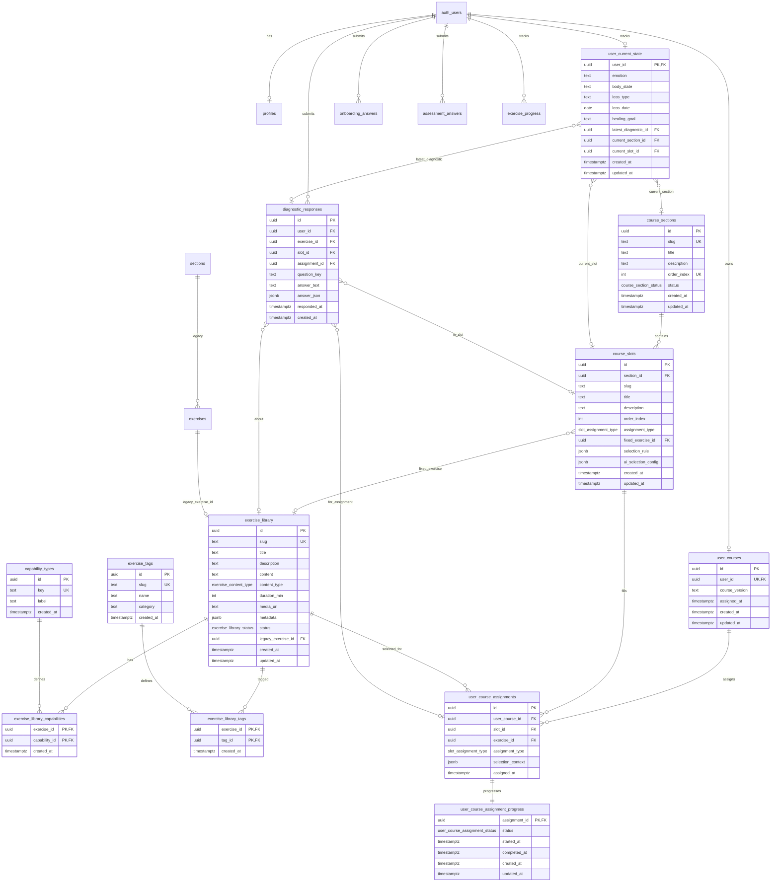

# Course Database ER Diagram

> Generated for the course architecture refactor (`20260708120000_course_architecture_refactor.sql`).
> Legacy MVP tables are preserved for backward compatibility.

## Mermaid ER Diagram



## Architecture Notes

### Layering

| Layer | Tables | Purpose |
|---|---|---|
| **Catalog** | `course_sections`, `course_slots`, `exercise_library`, tags, capabilities | Immutable course definition + exercise pool (500+ scalable) |
| **Personalization** | `user_courses`, `user_course_assignments` | Per-user frozen exercise selections |
| **Runtime** | `user_course_assignment_progress`, `user_current_state` | Mutable progress and position |
| **History** | `diagnostic_responses` | Append-only diagnostic answers |
| **Legacy** | `sections`, `exercises`, `exercise_progress` | MVP compatibility (unchanged) |

### Slot Assignment Types

| Type | `course_slots` fields | Resolution |
|---|---|---|
| `fixed` | `fixed_exercise_id` | Always the same library exercise |
| `rule_based` | `selection_rule` (JSONB) | Resolved at assignment time from rules + user state |
| `ai_selected` | `ai_selection_config` (JSONB) | Resolved by AI at assignment time |

### Immutability

- `user_course_assignments` — **no UPDATE/DELETE** (trigger enforced)
- `diagnostic_responses` — **no UPDATE/DELETE** (append-only history)
- Progress changes go to `user_course_assignment_progress` only

### Normalized Capabilities (no booleans on exercises)

Instead of `has_audio`, `has_video`, `has_diagnostic`:

```
exercise_library → exercise_library_capabilities → capability_types
```

### Indexing Strategy (500+ exercises)

- B-tree on `exercise_library(status, content_type)`
- GIN on `exercise_library.metadata`
- GIN trigram on `exercise_library.title` (search)
- Junction table indexes on `(tag_id, exercise_id)` and `(capability_id, exercise_id)`
